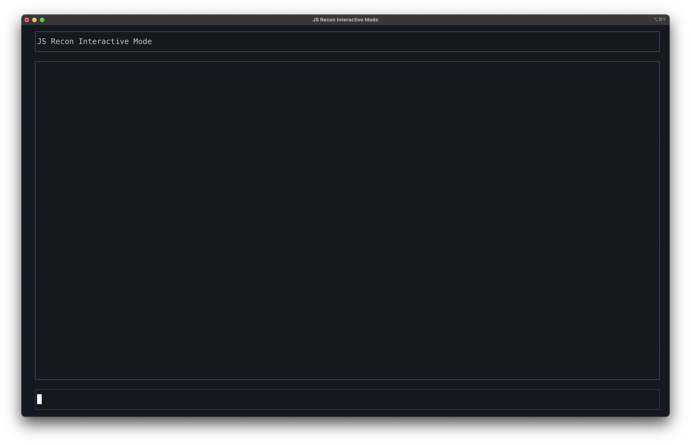
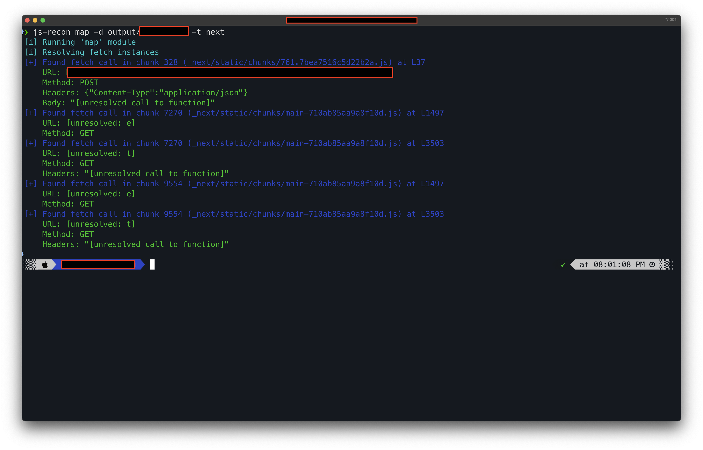
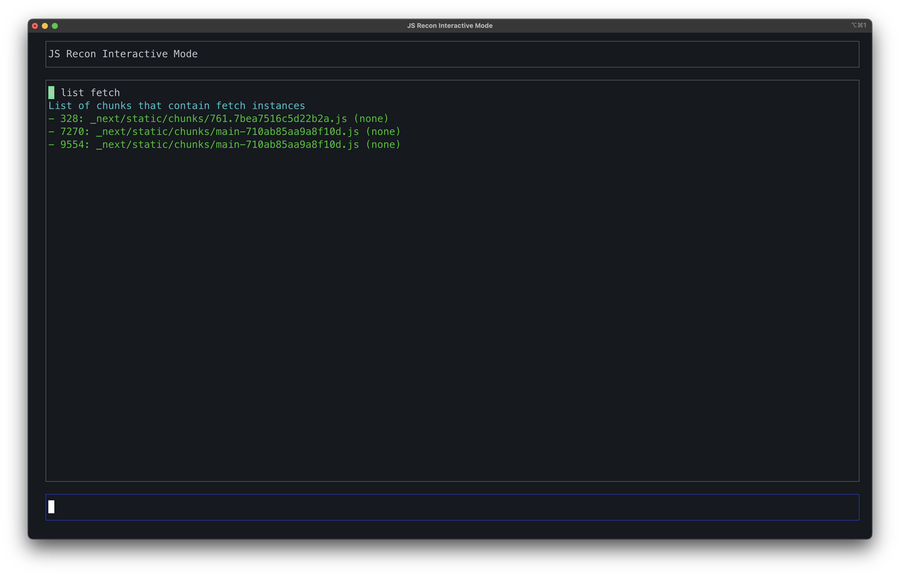
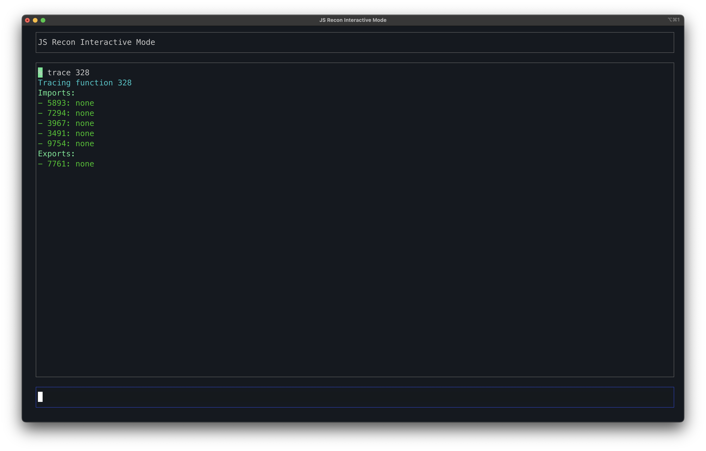

# Reversing `fetch()`

The [previous guide](./fuzzing_endpoints.md) walks through using the [`strings`](../../docs/modules/strings.md) module to discover client-side and server-side endpoints. This document walks through how can you use the interactive mode to reverse engineer the requests. This would require you to have some basic knowlege of reviewing JavaScript, or just code review in general.

The approach shown in this document is called the bottom-top approch, in which the user finds potential sinks, and goes up to the source. If this statement seems a bit confusuing don't worry. You'll understand this in this document down below.

## Fundamentals

To start reverse engineering the JS files, you should first list out all the functions available in the application.

Before that, you should understand how the functions are distributed in the Next.JS apps. Here's a brief overview of what you should know before you can start analyzing the code manually:

-   When the Next.JS apps are compiled, the functions gets distributed into webpack having a specific numerical ID
-   These files often contain the path `/_next/static/chunks`
-   If you see the directory structure of the `output` directory, you would find the following structure

```
❯ tree
.
└── output
    └── &lt;domain&gt;
        ├── _next
        │   ├── data
        │   │   └── k7xKVnxmboK4SktY2dZWt
        │   │       └── index.json
        │   └── static
        │       ├── chunks
        │       │   ├── 12.7e6d2ac6e1808fc2.js
        │       │   ├── framework-64ad27b21261a9ce.js
        │       │   ├── main-710ab85aa9a8f10d.js
        │       │   ├── pages
        │       │   │   ├── _app-c449865c8af1faa0.js
        │       │   │   ├── _error-77823ddac6993d35.js
        │       │   │   ├── -af5a23529ce3c337.js
        │       │   │   └── 5D-af5a23529ce3c337.js
        │       │   ├── polyfills-78c92fac7aa8fdd8.js
        │       │   └── webpack-efff35ee26971294.js
        │       └── k7xKVnxmboK4SktY2dZWt
        │           ├── _buildManifest.js
        │           └── _ssgManifest.js
        └── cdn-cgi
            └── scripts
                └── 5c5dd728
                    └── cloudflare-static
                        └── email-decode.min.js
```

The files that you'll be mostly spending your time analyzing are the files in the `./output/\<domain\>/_next/static/chunks`.

Upon reviewing the structure of each file, you'll find patterns like the following in most of the files:

```js
(self.webpackChunk_N_E = self.webpackChunk_N_E || []).push([
    [614],
    {
        3253: function (a, t, h) {
            // --snip--
        },
    },
]);
```

Here, you will notice that three argumenta - namely `a`, `t`, and `h` - are being passed. These variables have the following meaning:

-   `a` => module: Represents the current module object. Contains metadata like exports, id, etc
-   `t` => exports: The object that the module uses to export its public API
-   `h` => require: The require function used to import other modules

Now, suppose a function exports a particular action. This could be represented in multiple ways. One can identify these with practice, however, here are the most common ones:

```js
Object.defineProperty(t, "appBootstrap", {
  enumerable: !0,
  get: function () {
    return n;
  },
}),
```

In this case, the variable `t` represents `exports`.

```js
h.d(c, {
    $60: function () {
        return n;
    },
    qKv: function () {
        return r;
    },
});
```

In this case, the variable `h` represents an imported function, and the `d` is the method to define exports.

By understanding these, you should be good to go for reversing the apps.

## Getting connections with the `map` module

The map module helps to simplify the process of finding connections. To get started with finding connection, you have to download all the JS files. You can refer to the docs for the [`lazyload` module](../../docs/modules/lazyload.md#basic-usage) for instructions on downloading JS files. Once you have all the JS files downloaded you can proceed further with the `map` module.

You can get started with the following command:

```bash
js-recon map -d output/<domain> -t <tech> -i

# since the tool supports next js at the time of writing this, so the command would be
js-recon map -d output/<domain> -t next -i
```

This will analyze all the files, and open up an interactive shell like this:


:::info
If you don't pass the -i flag, then the tool will just show the information it could extract from the JS files, like the fetch instances, AI descriptions (if enabled), etc. An example output is shown below:

:::

Before getting started, you should run `help` in the interactive mode to see a list of available commands. Once you've read through the help menu, you can proceed further.

### Listing all `fetch()` instances

When reversing for APIs, the first thing that you would like to do is to list all the instances of `fetch()`. To do so, you can run the command `list fetch` to get a list of functions that contains `fetch()`.


Here, the output format is the following:

```
- <function_id>: <file_name> (<function description>)
```

### Getting function descriptions

Since there is no function description assigned, it shows `none`. You can use AI to generate function descriptions. Passing the `--ai description` flag to the `js-recon` command's [`map` module](../../docs/modules/map.md) will also generate an AI description for all the functions that it finds. You can refer to the docs for the same [here](../../docs/modules/map.md#ai-powered-analysis)

### Navigating around functions

Now, you can write this function to a separate file to remove the hassle of having to navigate to that particular file. Run the following commands in interactive mode to write it to a file:

```
set funcwritefile <filename>
go to <function_id>
```

For example, from the above screenshot, if I would have to write the function ID `328` to a file `328.js`, then the commands would be:

```
set funcwritefile 328.js
go to 328
```

:::info
After running the `set funcwritefile` command, if you run the `go` command, then the code for the speified/resultant function will be written to this file.
:::

:::tip
If you are just analyzing the files, you can go with a file name `test.js` - `set funcwritefile test.js`.
:::

:::tip
If you think the function does something important, then you can set the output filename to the specified function name - `set funcwritefile 328.js`
:::

If I also wish to write all the functions that `328` imports, then I could set the value of `writeimports` to true

```
set writeimports true
```

Now, this will also write the code for the imports for the specified functions

:::info
Imports not just means the external libraries the developers used in that particular function, but it could also mean UI components, other functions which also has a `fetch()`, etc.
:::

#### Following the execution flow

Suppose you got an interesting function and you want to now trace the execution path for it. You can definitely do it in the browser, but JS Recon also provides a way to do so.

For the example, you can assume that the function is `328`. Now, I can run the following command to get a list of imports and exports for that function:

```
trace 328
```



Once you got the imports and exports, and then you inspected the code for several functions using the `go to` command, and now would like to see the history, you can run the following command:

```
list nav
```

While tracing a particular execution flow, you realized that you are not going the right path, then you can run the `go back` command, and it will print the code for the last function that you used the `go to` command with.
